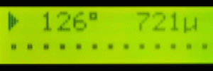

# fxBargraph

**Flexible LCD bargraph library for Arduino**


## Purpose

Bargraph / progress bar library with a variety of display options. Based on I2C LC displays.
Uses custom LCD characters for increased resolution, including a super high-res mode. Dynamic custom character defintion allows a very efficient use of the available characeter compared to similar libraries, leaving enough for other usage.
The dual bargraph mode enabled display of two independent graph in a single row, making best use of limited display space.


## Simple Example

```c++
#include <LiquidCrystal_I2C.h>
#include <fxbargraph.h>

LiquidCrystal_I2C lcd;

// display,x,y,width,id,maxvalue
fxBargraph bar(lcd, 0, 0, 16, 0, 1023);

void setup() {
  pinMode(A0, INPUT);
  lcd.begin();
}

void loop() {
  bar.setValue( analogRead(A0) );
}
```


## Features

- Variety of bar styles
- Left-to-Right and Right-to-Left support
- User-defined character for empty space
- Uses only single custom character per graph
- Dynamic customer character definition
- High resolution graphs utilizing every pixel
- Optimized display redraw
- Variant for 2 independent graphs in single row


## Videos

**High resolution bar**

[]


## Dependencies

This library depends on the following libraries:

- LiquidCrystal_I2C https://github.com/johnrickman/LiquidCrystal_I2C


## History

### 0.9.0
  - initial github commit
